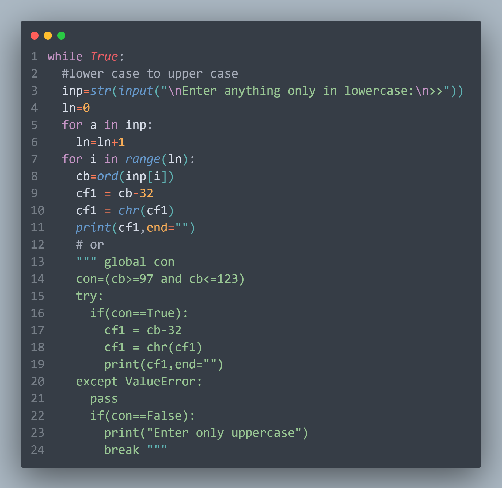
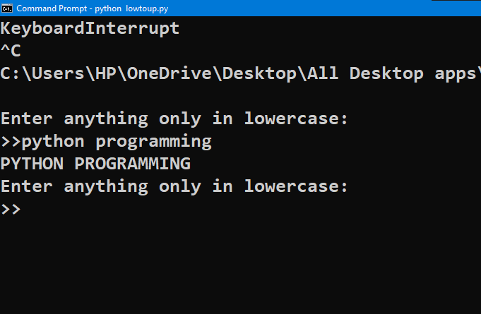
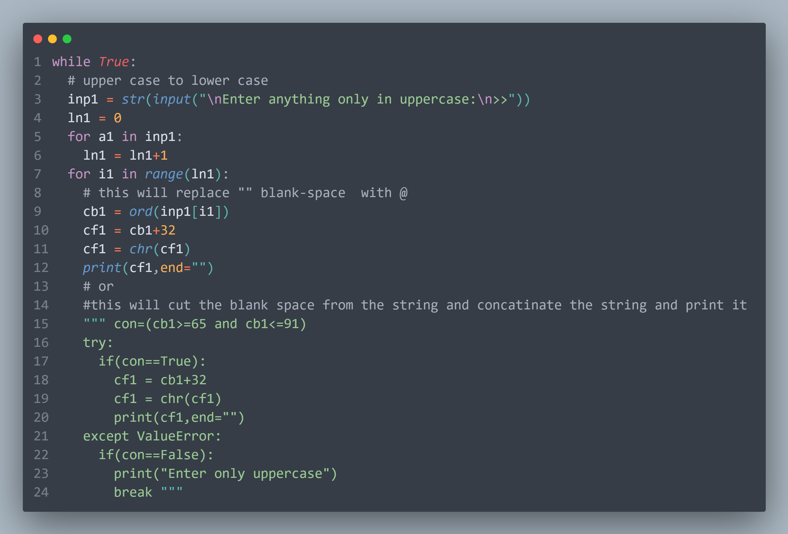
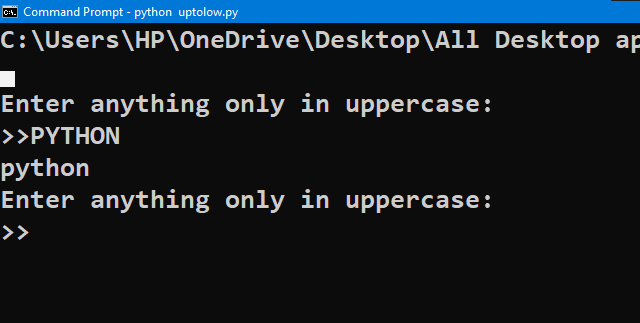
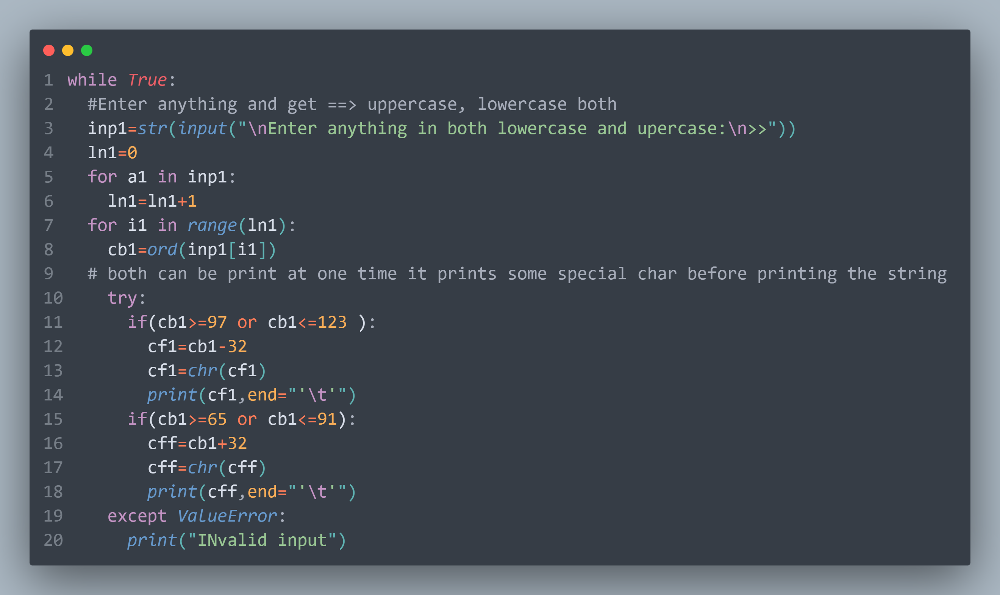
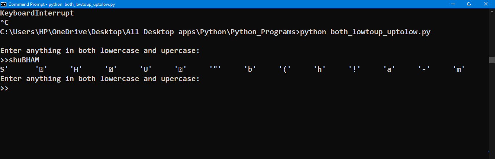

<h1 align="center">
   
  <b><i>#Lower_to_UpperCase</i></b>
  <b><i>#Upper_to_LowerCase</i></b>
</h1>
<h1>
Convert LowerCase input to upperCase
</h1>

<h1>
Convert UpperCase input to LowerCase
</h1>

<h1>
Both LowerCase input to upperCase & UpperCase input to LowerCase
</h1>

<h2>
  <i>
 

🚀 #You can Download, the 👆 FILES uploaded and run it, you will get the same #OUTPUT 🚀

</i>
</h2> 
